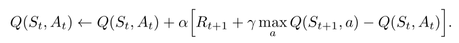
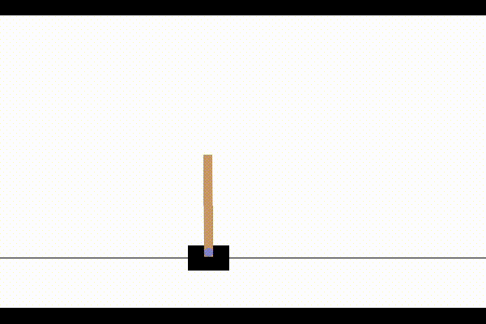
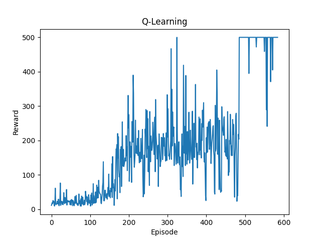
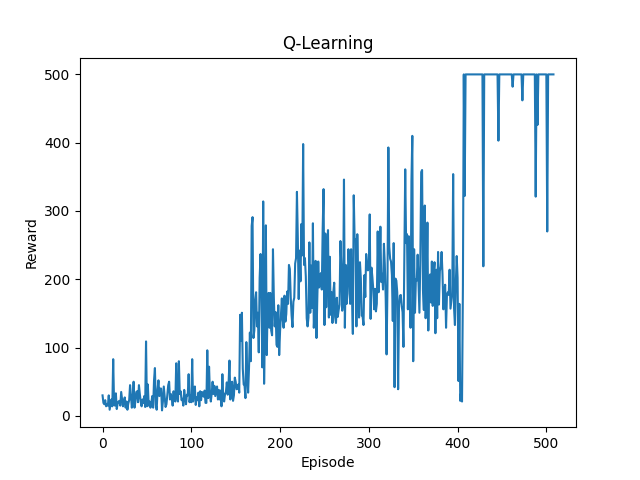
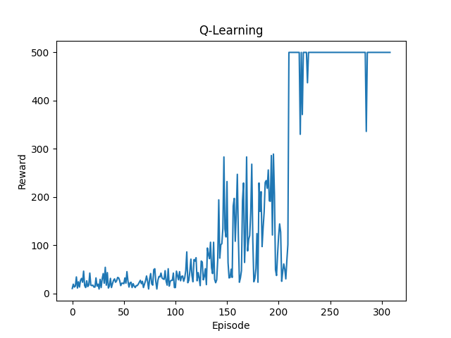

# Q-learning applied to OpenAI's cart-pole problem

</img>

This is my implementation of Q-learning on OpenAI's cart pole problem. Despite the state space being continuous for this problem, I discretize the values into buckets allowing Q-learning to function. 

The model fairly consistently solves the environment in about 600 episodes.

## Behvaiour




To allow the agent to explore the complex environment and build up an optimal policy without converging on a suboptimal policy too quickly we implement a decaying exploration and learning rate. The exploration rate decays as does the learning rate until after a large amount of exploration, the agent then exploits the more optimal path to balance the pole. 

The model has no separate exploration and exploitation phases, but rather gradually moves towards more exploitation as time goes on. This means that in some cases where it fails to explore the environment fully before it begins to exploit it, it can take significantly longer to solve the problem - however, this is quite rare. The model will always explore even in the later stages, just at a significantly reduced amount.

## Results

The learned model balancing the pole.



## Runs





## Todo

- [x] Q-learning
- [ ] Deep Q-learning

## Inspired by / References
```bibtex
@book{ sutton_barto_2018, 
    title={Reinforcement Learning: An Introduction}, 
    publisher={MIT Press Ltd}, 
    author={Sutton, Richard S. and Barto, Andrew G.}, 
    year={2018}
}
```
