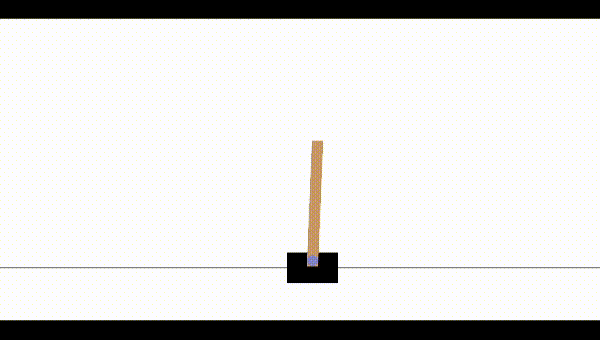

# Q-learning applied to OpenAI's cart-pole problem

This is my implementation of Q-learning on OpenAI's cart pole problem. Despite the state space being continuous for this problem, I discretize the values into buckets allowing Q-learning to function. 

The model fairly consistently solves the environment in about 600 timesteps.

## Example

The model learning to balance the pole with the cart

## Runs

